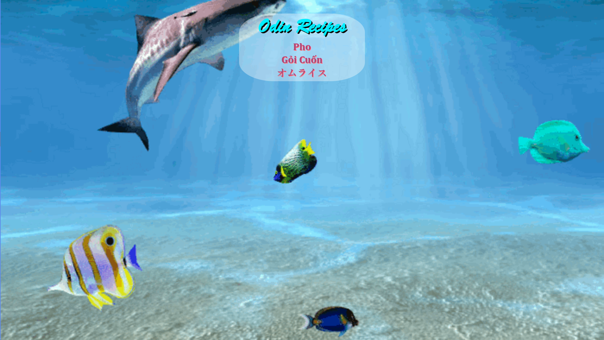

# Odin Recipes
This is the first project from [The Odin Project](https://github.com/TheOdinProject) curriculum — a very basic website that links to a few simple recipes.

## Skills Learned

### Git Basics
- Git commands
- Git workflow

### HTML Foundations
- Elements and tags
- HTML boilerplate
- Working with text
- Lists
- Links and images

### CSS Foundations
- Add styles to HTML with CSS.
- Understand how to use the class and ID attributes.
- Add styles to specific elements using the correct selectors.
- The Cascade
- Inspecting HTML and CSS
- The Box Model
- Block and Inline